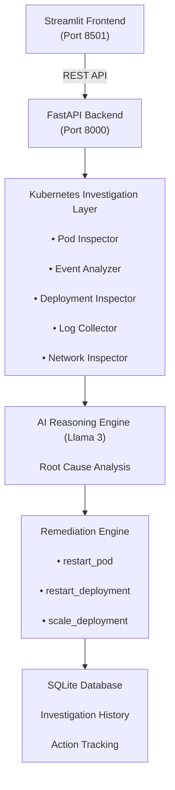

# K8s AI Agent 🤖⚙️

An AI-powered Kubernetes troubleshooting agent that autonomously investigates cluster failures, diagnoses root causes with 90%+ confidence, and executes human-approved remediation actions.

[](https://www.python.org/downloads/release/python-3110/)
[](https://fastapi.tiangolo.com/)
[](https://kubernetes.io/)
[](LICENSE)


---

## 📋 Table of Contents

- [Overview](#overview)
- [Key Features](#key-features)
- [Architecture](#architecture)
- [Quick Start](#quick-start)
- [How It Works](#how-it-works)
- [Production Roadmap](#production-roadmap)
- [Project Structure](#project-structure)
- [Technologies](#technologies)

---

## 🎯 Overview

Manual Kubernetes troubleshooting takes **30-60 minutes per incident**. This agent reduces that to **under 5 minutes** by:

1. **Automatically detecting** cluster failures
2. **AI diagnosing** root causes with reasoning
3. **Suggesting remediation** with human approval
4. **Executing fixes** safely

> **Status:** Proof of Concept (POC) — Production roadmap included!

---

## ✨ Key Features

### 🔍 Autonomous Investigation
- Inspects pods, deployments, services, events, and logs
- Detects 8+ failure patterns automatically
- Namespace filtering for targeted diagnostics

### 🧠 AI-Powered Diagnosis
- Uses Llama3 (local) or OpenAI (production)
- Analyzes root cause with confidence score
- Explains findings in natural language
- Suggests prevention strategies

### ✅ Human-in-the-Loop Safety
- Agent NEVER acts without approval
- Users review findings before any action
- Full audit trail of decisions
- Principle of least privilege (RBAC)

### 📊 Investigation History
- SQLite database stores every investigation
- See what happened last week, month, year
- Statistics dashboard
- Compliance-ready audit trail

### 🐳 Production Ready
- Multi-stage Docker builds
- K8s deployment manifests with RBAC
- GitHub Actions CI/CD
- Health checks and probes included

---

## 🏗️ Architecture

---

## 🚀 Quick Start

### Prerequisites
```bash
# Required
- Docker Desktop
- minikube
- kubectl
- Git

# Optional (for local LLM)
- Ollama
- Llama3 model (ollama pull llama3)
```

### Installation (2 minutes)

```bash
# 1. Clone repository
git clone https://github.com/Sakthiz/k8s-ai-agent.git
cd k8s-ai-agent

# 2. Create and activate virtual environment
python -m venv venv
source venv/Scripts/activate  # Windows

# 3. Install dependencies
pip install -r requirements.txt

# 4. Create .env file
cp .env.example .env
# Edit .env with your settings
```

### Running Locally (3 commands)

```bash
# Terminal 1: Start minikube
minikube start --driver=docker

# Terminal 2: Start Ollama (if using local)
ollama serve

# Terminal 3: Start the agent
docker compose up --build

# Access:
# FastAPI: http://localhost:8000/docs
# Dashboard: http://localhost:8501
```

---

## 🔄 How It Works

### Step 1: Investigate
User selects namespace and clicks "Investigate"
↓
Agent automatically:
→ Runs kubectl get pods -n namespace
→ Runs kubectl get events -n namespace
→ Collects logs from problematic pods
→ Analyzes deployment status
→ Checks networking
### Step 2: AI Diagnoses
Investigation data fed to Llama3 with prompt:
"You are a senior K8s SRE. Diagnose this cluster
investigation and suggest a fix."
↓
AI returns:
→ Root Cause (95% confidence)
→ Explanation
→ Suggested Fix
→ Prevention Strategy
### Step 3: Review & Approve
Dashboard shows:
✓ What's wrong (root cause)
✓ Why it happened (explanation)
✓ Suggested actions (with kubectl commands)
✓ Risk level (LOW, MEDIUM, HIGH)
↓
User reviews and clicks "Approve" or "Reject"
### Step 4: Execute
Agent executes ONLY approved actions:
→ kubectl delete pod {name}
→ kubectl rollout restart deployment {name}
→ kubectl scale deployment {name} --replicas=N
↓
Result saved to database with timestamp

### Sample Output
🔍 Cluster Investigation Complete!
Cluster Summary:
Total Pods: 9
Problematic: 2
Critical Events: 6
Network Issues: 1
🧠 AI Diagnosis:
Root Cause: Image pull failure due to incorrect image tag
Confidence: 95%
Suggested Fix:
1. Restart pod broken-app-595b95c856-n5xmx
2. Update image to nginx:latest
Prevention:
- Use image tags from official registries
- Implement image pull policy verification

---

## 🛣️ Production Roadmap

This is a **Proof of Concept**. To move to production:

### Phase 1: Authentication & Authorization
- [ ] OAuth2/OIDC integration
- [ ] User role management
- [ ] API key authentication
- [ ] Multi-tenant support

### Phase 2: Enterprise LLM Integration
- [ ] Azure OpenAI API
- [ ] Groq API (faster inference)
- [ ] Custom prompt engineering
- [ ] Model fallback strategy

### Phase 3: Persistent Storage
- [ ] PostgreSQL for production database
- [ ] Redis for caching
- [ ] S3 for log storage
- [ ] Time-series database for metrics

### Phase 4: Observability
- [ ] Prometheus metrics
- [ ] Distributed tracing
- [ ] Structured logging
- [ ] Grafana dashboards

### Phase 5: Advanced Features
- [ ] Multi-cluster support
- [ ] Incident auto-grouping
- [ ] Escalation policies
- [ ] Slack/Teams integration
- [ ] Webhook notifications

**Estimated timeline:** 3-4 months with a team of 2-3 engineers

---

## 📁 Project Structure

```text
k8s-ai-agent/
├── backend/
│   ├── kubernetes/                  # K8s investigation layer
│   │   ├── kubectl_executor.py
│   │   ├── pod_inspector.py
│   │   ├── log_collector.py
│   │   ├── event_analyzer.py
│   │   ├── deployment_inspector.py
│   │   ├── network_inspector.py
│   │   ├── investigation_service.py
│   │   └── remediation.py
│   │
│   ├── ai/                          # AI reasoning engine
│   │   ├── llm_client.py
│   │   ├── prompt_builder.py
│   │   └── reasoning_engine.py
│   │
│   ├── db/                          # Database layer
│   │   ├── database.py              # SQLite operations
│   │   └── models.py                # Pydantic models
│   │
│   ├── core/                        # Configuration
│   │   ├── settings.py
│   │   └── logger.py
│   │
│   ├── api/                         # FastAPI routes
│   │   └── routes.py
│   │
│   └── services/                    # Business logic
│       └── agent_service.py
│
├── frontend/
│   ├── app.py                       # Streamlit dashboard
│   └── Dockerfile
│
├── k8s/                             # Kubernetes manifests
│   ├── namespace.yaml
│   ├── serviceaccount.yaml          # RBAC configuration
│   ├── configmap.yaml
│   ├── secret.yaml
│   ├── backend-deployment.yaml
│   ├── frontend-deployment.yaml
│   ├── backend-service.yaml
│   ├── frontend-service.yaml
│   └── deploy.sh
│
├── .github/
│   └── workflows/                   # CI/CD pipelines
│       ├── ci.yml                   # Tests, linting, security
│       └── docker-build.yml         # Docker build verification
│
├── docs/                            # Documentation
│   ├── ARCHITECTURE.md
│   ├── DEPLOYMENT.md
│   ├── DEVELOPMENT.md
│   └── screenshots/
│
├── tests/                           # Unit tests
│   └── test_basic.py
│
├── main.py                          # FastAPI entry point
├── requirements.txt                 # Python dependencies
├── docker-compose.yml               # Local development
├── Dockerfile                       # Deprecated (use backend/frontend versions)
├── .dockerignore
├── .gitattributes
├── .gitignore
└── README.md                        # Project documentation
```

## 🛠️ Technologies

### Backend
- **FastAPI** — Modern Python web framework
- **Pydantic** — Data validation
- **Ollama + Llama3** — Local LLM (production: OpenAI/Azure)
- **SQLite** — Lightweight database

### Frontend
- **Streamlit** — Beautiful Python dashboards
- **httpx** — HTTP client

### DevOps
- **Docker** — Containerization (multi-stage builds)
- **Kubernetes** — Orchestration (with RBAC)
- **GitHub Actions** — CI/CD pipeline
- **minikube** — Local K8s development

### Code Quality
- **Flake8** — Linting
- **Bandit** — Security scanning
- **Pytest** — Unit testing

---

## 🔐 Security

### Implemented
- ✅ Non-root container user
- ✅ RBAC with least privilege
- ✅ Health checks and liveness probes
- ✅ No hardcoded credentials (using secrets)
- ✅ Security scanning in CI/CD
- ✅ Input validation (Pydantic)

### Future
- 🔲 OAuth2 authentication
- 🔲 Encryption at rest
- 🔲 API rate limiting
- 🔲 Audit logging

---

## 💡 Key Design Decisions

### Why Llama3 for POC?
- **Free** — No API costs
- **Local** — No latency, privacy
- **Easy to swap** — 2 lines to change to OpenAI

### Why Streamlit?
- **Fast** — Build UIs without frontend skills
- **Pythonic** — Data scientists ❤️ it
- **Works great** — Perfect for internal tools

### Why SQLite?
- **Zero setup** — Single file
- **Easy to migrate** — PostgreSQL later
- **Perfect for POC** — No database server needed

### Why Multi-Stage Docker?
- **60% smaller images** — Faster deployments
- **Security** — No build tools in production
- **Industry standard** — Shows you know best practices

### Why Human-in-the-Loop?
- **Safety** — Agent never acts unsupervised
- **Learning** — Teams understand decisions
- **Compliance** — Audit trail for regulations
- **Trust** — Users control their infrastructure

---

## 📚 Documentation

- [Architecture Deep Dive](docs/ARCHITECTURE.md)
- [Deployment Guide](docs/DEPLOYMENT.md)
- [Development Guide](docs/DEVELOPMENT.md)

---

## 🤝 Contributing

This is a portfolio project. For questions or suggestions, open an issue!

---

## 📄 License

MIT License — See LICENSE file

---

## 👨‍💻 Author

**Sakthi Manikandan**
- GitHub: [@Sakthi-Manikandan](https://github.com/Sakthi-Manikandan/)
- LinkedIn: [sakthi-manikandan](https://www.linkedin.com/in/sakthi-manikandan/)
- Email: sakthimanikandan1718@gmail.com

---


This project demonstrates:
- Deep Kubernetes knowledge
- AI/ML integration (LLMs)
- Full-stack DevOps (Docker, K8s, CI/CD)
- Production-grade code quality
- System design thinking

---

## 📞 Let's Connect!

If you're building amazing products and need someone who understands Kubernetes at the system level, [let's talk!](https://www.linkedin.com/in/sakthi-manikandan/)

---

**Happy investigating! 🚀**
